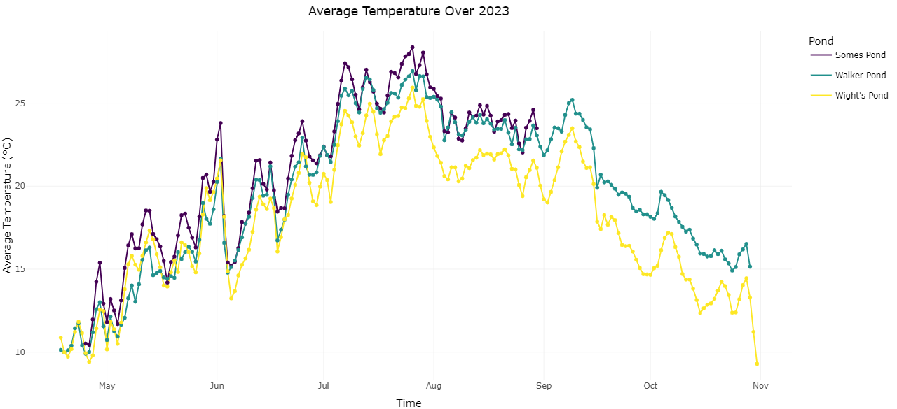
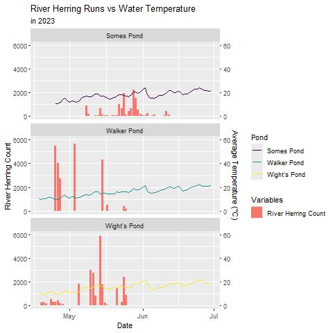
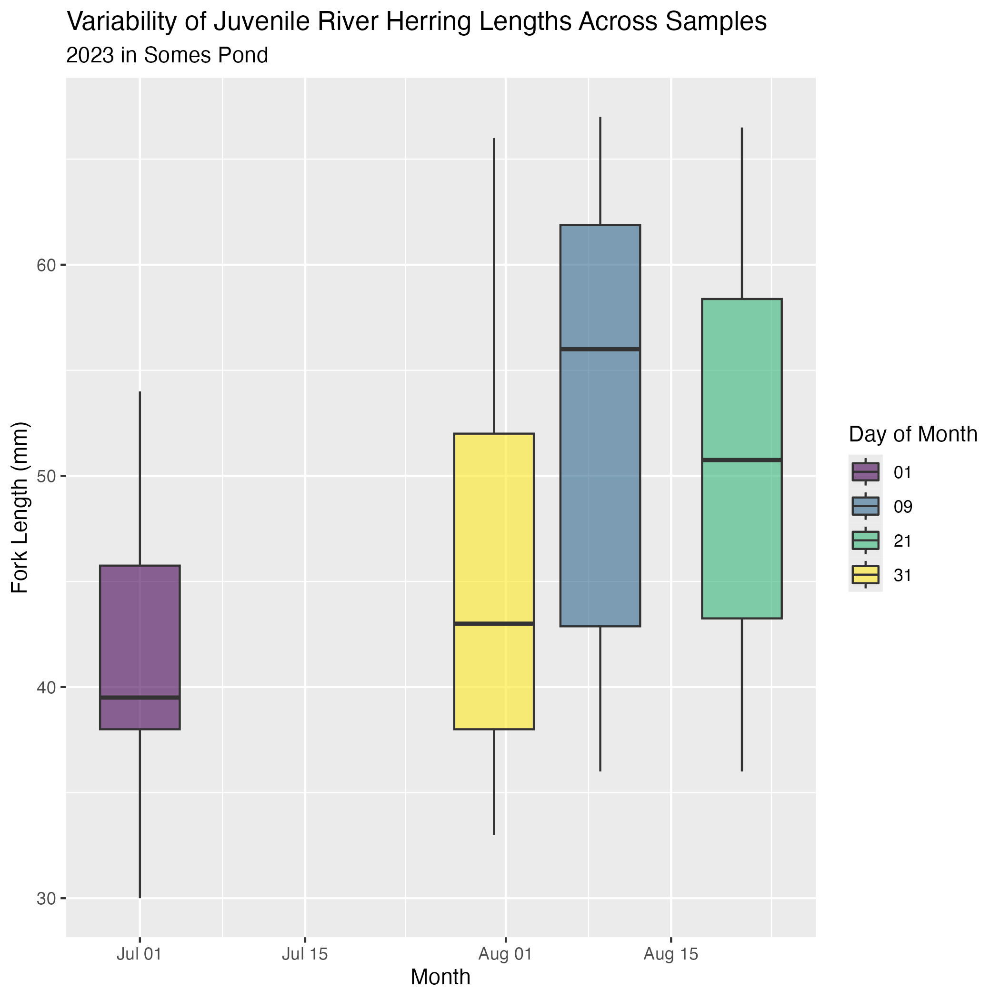
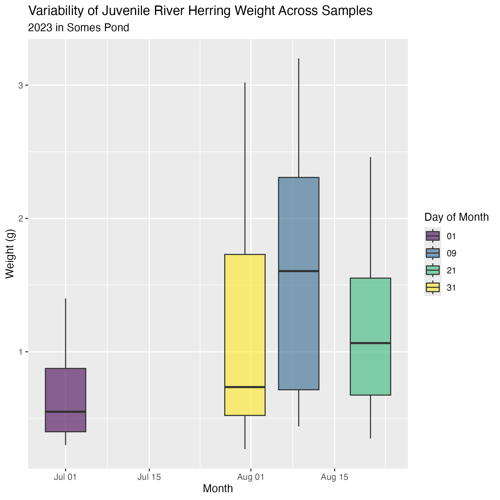
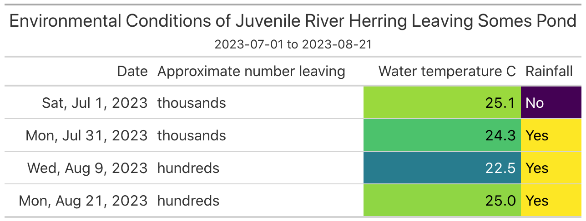

## Project Background

River herring are small, silver anadromous fish that migrate between the ocean—where they spend their adult lives—and ponds and streams, where they reproduce, every spring. This migration is called a run. “River herring” is actually the term for two species, blueback herring and alewives. We lump them together because they are virtually visually indistinguishable and have many similar life history traits. Their populations seriously declined as rivers were dammed to power mills and more recently as road crossings and hanging culverts and large hydroelectric dams have prevented them from reaching their spawning grounds. 

Many grassroots efforts around restoration, monitoring, and community building around these fish have had positive effects, and the populations are slowly increasing in Maine. 
The community partners for this project was the Gulf of Maine River Herring Network. They, by their own description, bring together the wide range of stakeholders working on river herring management, research, restoration, and monitoring in the Gulf of Maine. They emphasize long-term stewardship, and working with harvesters and other stakeholders. 

This project came out of some data management that the network had been doing. Many different researchers and stakeholders around the coast count the fish on their runs, sometimes to fulfill requirements for harvest and sometimes to do research or monitor the effects of a restoration project. This is valuable information, especially because each river or run is so unique, but it’s a lot of data from a lot of different places and it can be really difficult to see the relationships between different factors and places when the data is all in different forms. Much of this data also informs fisheries and species management at the municipal, state, and federal/interstate levels. 

Shea Turner-Matthews and Emily Rose Stringer created a beta version of the first website during their summer internship in 2023. This existing App includes Annual data from 1981 to 2021 across 22 sites and Daily count data from 2020 to 2021 from 2  sites. The website Compares run counts trends throughout the individual season(s) and over multi-year periods. There is also a spatial comparison component to the app through interactive maps between states. A run timeline is extrapolated from the data to compare run duration at each site and how it varies through the years. At the end of the app tabs there is an area to Download and upload data links. Allowing for harvesters to upload new data that will be reviewed before added to the website existing dataset. There are still some limitations of how the code is organized and presented throughout the app.

## Project Outputs

### Refined app 

<iframe src="https://laurie-the-student-baker.shinyapps.io/shad-river-herring-in-development/" width = "100%" height = "500" title="Shad and River Herring Run Data Portal"></iframe>

The existing app was improved both through adjusting the back code as well as what is presented in the website itself. Firstly we worked on workability, organization, and longevity of the existing apps code. This was executed through organizing code chunk placement, collapsible organization, and organizational comments that expresses what the code chunks mean. The improvement of the back end of the code creates a more accessible environment for new partners working with, understanding, and avoiding bugs with the code. 

The website itself was approved as well to be more accessible to users. New annual and daily data was updated into the website for 2022 and 2023, now adding five more sites for daily data. The map icons were debugged, allowing everyone with the website link to see the icons pop-up. There are textual pop-ups on the maps when hovering over the icon as well. The pop-up information includes the multiplicity, harvesting status, count technique to collect data, restoration efforts, and latest count. Textual data gives background on each site to understand where the data is coming from. This also gives some more credit to the people who are collecting the data. 

The map and graphic for each tab is conditional to what state, year, watershed, and full location that is selected. This allows one to narrow down levels of comparison over time and space scale. Now instead of only being able to compare at a state spatial level, users can compare between and within each watershed area. These improvements add another level of organization and comparison of the data.

### Environmental app 
<iframe src="https://laurie-the-student-baker.shinyapps.io/shad-river-herring-environmental-app/" width = "100%" height = "500" title="Shad and River Herring Environmental Data Portal"></iframe>

One of the outputs of the project was creating a preliminary data portal that links environmental factors data with river herring count data. The desired output of the app would be to be able to visualize relationships between river herring count and environmental factors, like precipitation, temperature, and stream flow. We started with making some visualizations of temperature and count data of the various ponds to be included in the environmental app. This required a great deal of organization and management of the various data sets that we were working with. 

Below are some of the graphs we generated for the app while keeping our community partners in the loop and incorporating their feedback.
  
Figures 1 and 2 show 2023 temperature distribution and trends across multiple ponds. 
 
  <figure>
    
    <figcaption>Figure 1. Average Water Temperature (°C) Distribution in 2023 by pond.</figcaption>
</figure>
  
  <figure>
    
    <figcaption>Figure 2. Average Water Temperature (°C) Trends in 2023 by pond.</figcaption>
</figure>
  
  
Figure 3 is a line graph of the changes in average daily temperature of Somesville, Wight’s, and Walker ponds in 2023. 

<figure>
    
    <figcaption>Figure 3. Average Water Temperature (°C) in 2023 by pond.</figcaption>
</figure>

Figure 4 is a bar and line graph that displays the 2023 river herring count and average temperature of different ponds at the same time. 

<figure>
    
    <figcaption>Figure 4. Average Water Temperature (°C) vs. River Herring Count in 2023 by pond.</figcaption>
</figure>

Figure 5 is a table of the environmental conditions of juvenile river herring leaving Somesville Pond.

<figure>
    
    <figcaption>Figure 5. Variability of Juvenile River Herring Lengths across Samples.</figcaption>
</figure>

Figures 6 and 7 take a look at juvenile river herring count data in relation to their length and width.

<figure>
    
    <figcaption>Figure 6. Variability of Juvenile River Herring Weight across Samples.</figcaption>
</figure>

<figure>
    
    <figcaption>Figure 7. Environmental Conditions of Juvenile River Herring Leaving Somes Pond.</figcaption>
</figure>

After we had an idea what kind of graphs we and our community partners wanted on the environmental app, we stared working on creating the bones of the app using RShiny. We first loaded the packages and read-in the datasets we needed. Then we built a user interface that includes all the tabs that appear on the app’s frontend. We then defined the server which outlines the inputs and outputs of the app. On the server, we added the graphs we had made and assigned them to different tabs. The app is still in its early stages, and will need more development and updating. 

### Cleaned DFs and data management 
	
The data that we worked with for this project is almost all being taken by different people—usually harvesters, non-profits, or researchers—all across the coast using many different techniques and data structures. Additionally, each run has very different dynamics and contexts. The fish populations vary between runs and so does the history of passage impediment, restoration, harvest, predation, and more. Being able to capture some of that diversity is important, so we wanted to make sure that the data was linked up, or could later be linked up, with ‘metadata’ to provide context for the counts. 
We also wanted to make sure that the app would be (relatively) updateable. The hope is that this project will only grow with time, so it is important that it is easy to add data as the network and the project grow.

We primarily used the Tidyverse, specifically dplyR to tidy, join, and standardize the data. There were three kinds of data that we needed to work with to create our final datasets. The first was the count data itself. For many sites, we had daily data and annual data, though for some we just had daily data. The count data typically needed to be cleaned, sometimes pivoted into the correct form, and joined with other sites to create a larger dataframe. 
	
Where annual data was missing for a site with daily data, we used the cumulative count column to extrapolate an annual total to add to the annual data frame. At the end of this process, we had one data frame with all of the daily data and one with all of the annual data. The next step, after creating the two distinct data frames, was to join each of them with contextual metadata and watershed categorizations. The watershed data was pulled, in GIS, from USGS resources and joined using latitude and longitude. The metadata was provided by the River Herring Network, and will be entered by stewards going forward, and joined using site name, latitude, and longitude. The end result of this was two dataframes—one with daily data and one with annual data—that included watershed categorizations and contextual information about the run. These are the two data frames used for the coast-wide count application. 

A very similar process was followed to build the environmental data for the Maine platform. We took daily count data from the runs that the network monitors and joined it with temperature data from each of those sites by site name and municipality (where site names did not match). This was then added to the metadata and the watershed data to create one large data frame. 

## Team

- [Laila Hammoudeh ‘26](https://github.com/LailaHammoudeh)

- [Kristin Zunino ‘25](https://github.com/Kristinzunino)

- [Sophie Chivers ‘24](https://github.com/schivers24)

## Data
Access the project on [github](https://github.com/LaurieLBaker/shad-river-herring) and find out more about the data in the [codebook](https://github.com/LaurieLBaker/shad-river-herring/blob/main/shad-river-herring-in-development/data/README.md).

## Resources

- [R shiny resources](https://shiny.posit.co/r/getstarted/shiny-basics/lesson1/index.html)

## Acknowledgements

We’d like to thank Emily Farr, Mike Thalhauser, and Anne Zegers from the River Herring Network for all of their time helping us to contextualize and refine our work. We’d also like to thank Chris Petersen for helping bring us up to speed on all things community river herring restoration and Bailey Bowden for teaching us what a river herring run looks like (See figure 8). 

<figure>
    
    <figcaption>Figure 8. Installing River herring Trap on Wights Pond with Bailey Bowden,Penobscot Maine.</figcaption>
</figure>

We also would like to thank [Jonathan Evanilla](https://www.linkedin.com/in/johnathan-evanilla-904059172/) for a fantastic workshop on R Shiny that helped us refine our code and set up strong structures for the environmental data application. 
